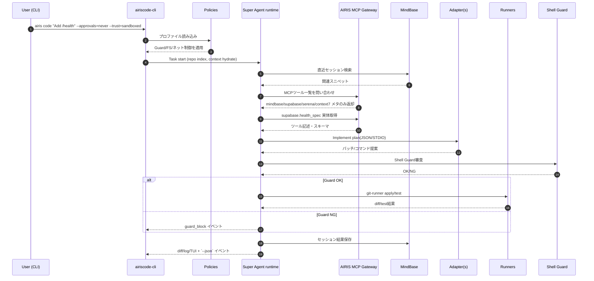
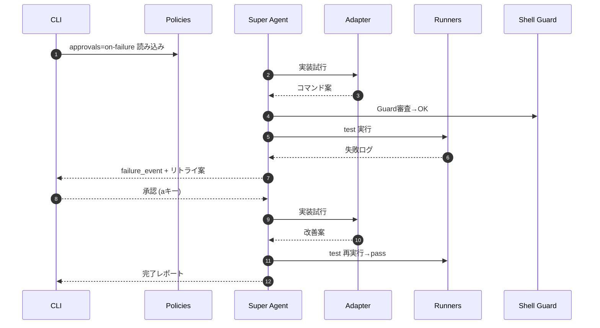

# ARCHTECHTURE

High-level architecture for **airiscode**, the terminal-first autonomous coding runner that stitches together Super Agent, SuperClaude assets, MindBase, and the AIRIS MCP Gateway.

---

## 1. Guiding Principles

1. **No reimplementation** – treat Claude Code, Codex CLI, Gemini CLI, Aider, etc. as child processes behind adapters. We wrap their JSON/STDIO APIs, never fork-and-hack upstream.
2. **LLM-agnostic core** – the orchestration runtime (Super Agent) never depends on a specific model. Drivers encapsulate OpenAI, Anthropic, Google, local models (Ollama/MLX/GPU servers).
3. **Dynamic tooling** – AIRIS MCP Gateway advertises tools lazily. MindBase, Serena, Context7, Supabase, etc. are only described to the LLM when the planner selects them.
4. **Memory with privacy** – MindBase keeps durable recall (conversation + task log) entirely local. Agents never resend secrets to the cloud but can expose scoped slices via MCP when explicitly requested.
5. **Strict policies** – the CLI enforces `--approvals` (never/on-request/on-failure) and `--trust` (restricted/sandboxed/untrusted). Shell Guard blocks `rm -rf /`, Docker prune, etc., regardless of which adapter issues the command.
6. **Terminal-first UX** – Ink-based TUI plus `--json` headless mode so CI/CD or other CLIs can embed airiscode as a step.

---

## 2. Monorepo Layout (Turbo + pnpm)

```
airiscode/
├─ apps/
│  └─ airiscode-cli/            # Ink+Commander CLI, policy enforcement, session UI
├─ packages/
│  ├─ drivers/                  # LLM drivers (openai, anthropic, google, local/ollama, mlx, remote-gpu)
│  ├─ adapters/                 # Child-process shims for Codex/Claude Code/Gemini CLI/Aider
│  ├─ mcp/
│  │  ├─ client/                # lazy tool discovery/help, MCP transport
│  │  └─ registry/              # tools.json templates w/ deferred descriptions
│  ├─ policies/                 # approval/trust profiles shared by CLI + adapters
│  ├─ sandbox/                  # shell-guard, deny/allow lists, static analyzers
│  ├─ runners/                  # git-runner (diff/add/commit/push), docker-runner (compose up/health)
│  └─ ux/                       # prompt assets, reporters, diff renderers
├─ tools/
│  └─ make/                     # reproducible make targets (setup, test, bench)
└─ docs/                        # ARCHTECHTURE.md (this file), API contracts, runbooks
```

---

## 3. Component Stack

| Layer | Responsibility | Notes / Source |
|-------|----------------|----------------|
| **Super Agent Runtime** | Confidence gating, reflexion, deep research planning, parallel execution | `/Users/kazuki/github/superagent` provides ABI modules under `src/superagent/api/*` |
| **SuperClaude Assets** | Claude Code plugin scaffolding, behavior scripts, MCP policy docs | `SuperClaude_Framework` (TS plugin version) and `SuperClaude_Plugin` (slash-command bundle) |
| **MindBase** | Durable semantic memory (pgvector + Ollama embeddings) | `/Users/kazuki/github/mindbase` – exposes `mindbase_store/search` MCP tools |
| **AIRIS MCP Gateway** | Registers 25+ MCP servers, lazily streams tool metadata, hosts HTTP/SSE endpoints | `/Users/kazuki/github/airis-mcp-gateway` |
| **airiscode CLI** | Single entrypoint for users, enforces policy, multiplexes drivers/adapters/runners, renders TUI | `apps/airiscode-cli` (to be implemented) |
| **Model Drivers** | Uniform `ModelDriver` interface, handles chat, tool calling, streaming | `packages/drivers/*` |
| **CLI Adapters** | Spawn child CLIs, normalize JSON output, enforce policies | `packages/adapters/{codex,claude-code,gemini-cli,aider}` |
| **Runners** | Deterministic git/diff workflow, Docker orchestration, test execution | `packages/runners/*` |
| **Shell Guard** | Parses proposed shell commands, blocks/rewrites dangerous operations | `packages/sandbox/shell-guard` |

---

## 4. Execution Flow

1. **User command** – e.g.\
   `airis code "Add Supabase /health endpoint and verify with curl" --approvals=never --trust=sandboxed --adapters=codex,claude-code --tools=mcp:supabase,mcp:mindbase`

2. **Session bootstrap** (CLI):\
   - Load policy profile (`packages/policies/approvals`).\
   - Initialize MindBase client (used for session recall).\
   - Detect available adapters/LLM drivers (PATH + config).\
   - Render TUI panes: task log, diff preview, policy indicators.

3. **Planning (Super Agent ABI)**:\
   - `superagent.api.confidence.evaluate_confidence` gate ensures readiness (duplicate checks, doc verification flags).\
   - Deep research plan generated as needed (`api/deep_research`).\
   - Repo indexer builds/refreshes `PROJECT_INDEX.*` via `api/repo_index`.

4. **Tool orchestration**:\
   - AIRIS MCP Gateway exposes MindBase, Serena, Context7, Supabase tools.\
   - CLI requests tool list lazily; actual descriptions fetched via `mcp/client` only when invoked.\
   - Sub-agents (research, planner, implementer, reviewer) call MCP tools through the gateway; responses persisted back into MindBase.

5. **Adapter invocation**:\
   - For code editing, CLI chooses adapter(s) based on policy/perf (Codex, Claude Code, Gemini CLI, Aider).\
   - Each adapter runs as a child process with JSON/stdout contract. Shell Guard filters requested commands before execution.

6. **Runners & verification**:\
   - `git-runner` stages diffs, runs tests, handles commits/push (respecting approvals).\
   - `docker-runner` spins up services (compose up, health checks) when tasks require integration tests.

7. **Reporting & memory**:\
   - CLI emits diff summary, logs, test output to TUI + optional `--json`.\
   - MindBase stores final conversation chunk (task, steps, verdict) for future recall.

---

## 5. Model Strategy

| Target | Driver | Notes |
|--------|--------|-------|
| **Local-dev (default)** | `local-driver` → Ollama/MLX | Runs on M4 Air (32 GB). Test Qwen Coder 7B, DeepSeek Coder, Phi-3.5, etc. |
| **GPU server** | `remote-gpu-driver` | SSH/HTTP to Linux box with NVIDIA cards. Same `ModelDriver` interface. |
| **Cloud APIs** | `openai-driver`, `anthropic-driver`, `google-driver` | Optional. Adhere to CLI policies; tokens billed to user-provided keys. |

Benchmark harness (TBD) compares latency + output quality per driver so CLI can pick the best available model per task.

---

## 6. Policies & Safety

| Flag | Behavior |
|------|----------|
| `--approvals=never` | Fully autonomous, auto-retry (2s/4s/8s backoff), final diff/log dump |
| `--approvals=on-failure` | Run automatically, pause for input on errors |
| `--approvals=on-request` | Execute only when user presses `a`/`run` |
| `--trust=restricted` | Read-only FS, shell disabled |
| `--trust=sandboxed` | Workspace write allowed, external network blocked by default |
| `--trust=untrusted` | Full access, but Shell Guard still blocks denylisted commands |

Shell Guard parses every command (from adapters or MCP tools) before execution. Deny rules (`rm -rf /`, `docker system prune`, fork bombs, etc.) raise an incident and halt the workflow.

---

## 7. TUI / UX

- **Left pane**: task log with current step, sub-agent status, retry indicators.
- **Right top**: diff preview (scrollable, hotkey `D` to expand).
- **Right bottom**: live policy indicators (approvals/trust), adapter/model badges, MindBase connectivity.
- **Keybindings**: `j/k` scroll, `D` diff, `r` retry step, `a` toggle approval, `q` quit.
- **Headless**: `--json` dumps machine-readable events for CI or other orchestrators.

---

## 8. Deployment Targets

1. **Mac (M4 Air)** – Primary dev environment. Ollama provides local inference; Docker Desktop powers MindBase + AIRIS gateway.
2. **Linux GPU node** – Optional remote driver; same CLI kicks off jobs via SSH tunnel or HTTP gRPC proxy.
3. **Open-source release** – MIT license for airiscode CLI + packages; encourages community adapters. MindBase remains the monetization vector (managed hosting, secure context sharing, API quotas).

---

## 9. Roadmap Snapshot

1. **LLM Driver Matrix** – finalize `ModelDriver` interface, add latency/quality benchmarks, choose sensible defaults per task type.
2. **Adapter parity** – reach feature parity across Codex/Claude/Gemini/Aider (JSON normalization, error recovery, log streaming).
3. **Git/Docker runners** – expose deterministic pipelines (diff → test → commit → push, compose up → health → logs).
4. **MindBase insights** – auto-summarize stored conversations, surface reminders (e.g., “don’t retry this failed approach”).
5. **Monetization hooks** – optional MindBase cloud sync/API key management via MCP tokens, keeping airiscode itself free.

With this stack, airiscode becomes a terminal-native “super agent” that can compete with hosted coding assistants while remaining private, extensible, and fast on local hardware.

---

## 10. 補足メモ（日本語サマリ）

- **再実装しない／束ねるだけ**：各CLIは子プロセスとして扱い、I/Oだけ統一する。LLMの個性もライセンスも尊重できる。
- **責務の分離**：Super Agent＝頭脳、MindBase＋AIRIS Gateway＝記憶とツール供給、airiscode CLI＝司令塔。
- **階層メモリ**：短期（セッションキャッシュ）→中期（直近Nタスク）→長期（pgvector永続）でリフレクションを高速化。
- **状態機械化**：`plan → implement → verify → report` をJSONで保持し、`--resume` や再実行を安定化。
- **プラグイン市場**：`airis plugin add adapter:claude-code` のように宣言的に拡張できる設計を視野に入れる。
- **可観測性**：`--json` 時は `session_start`, `adapter_spawn`, `tool_call`, `guard_block`, `diff_commit` などを構造化ログで出力。
- **メタランタイム**：airiscode自体はステートレスで、MindBase接続時に“記憶を持つAI”へ昇華。ローカル/リモートGPUも一元制御可能。

---

## 11. 次のドキュメント課題

1. **実行フロー図（Sequence Diagram）** – CLI→Super Agent→MCP Gateway→MindBase→Adapters の呼び順と approvals/trust 介入ポイントを可視化。
2. **ModelDriver / AdapterProcess IDL** – `chat`, `toolCall`, `stream`, `spawn`, `events` などをproto/JSON schemaで定義し、将来のgRPC化に備える。

どちらもこの ARCHTECHTURE を土台に詳細化していく。

---

## 12. 実行シーケンス図（Mermaid）

### 通常フロー（`--approvals=never`, `--trust=sandboxed`）



### 失敗時介入（`--approvals=on-failure`）



---

## 13. gRPC / proto3 インターフェース (v0.1)

```proto
syntax = "proto3";
package airiscode.v1;

message SemVer { uint32 major = 1; uint32 minor = 2; uint32 patch = 3; }
message UUID { string value = 1; }
message Timestamp { int64 seconds = 1; int32 nanos = 2; }

enum ApprovalsLevel {
  APPROVALS_UNSPECIFIED = 0;
  APPROVALS_NEVER = 1;
  APPROVALS_ON_FAILURE = 2;
  APPROVALS_ON_REQUEST = 3;
}
enum TrustLevel {
  TRUST_UNSPECIFIED = 0;
  TRUST_RESTRICTED = 1;
  TRUST_SANDBOXED = 2;
  TRUST_UNTRUSTED = 3;
}
message PolicyProfile {
  ApprovalsLevel approvals = 1;
  TrustLevel trust = 2;
  bool guard_strict = 3;
}

message ToolSpecRef { string name = 1; map<string,string> hints = 2; }

enum EventKind {
  EVENT_UNSPECIFIED = 0;
  EVENT_SESSION_START = 1;
  EVENT_ADAPTER_SPAWN = 2;
  EVENT_TOOL_CALL = 3;
  EVENT_GUARD_BLOCK = 4;
  EVENT_DIFF_READY = 5;
  EVENT_TEST_START = 6;
  EVENT_TEST_RESULT = 7;
  EVENT_COMMIT = 8;
  EVENT_ERROR = 9;
  EVENT_SESSION_END = 10;
}
message Event {
  EventKind kind = 1;
  Timestamp ts = 2;
  UUID session_id = 3;
  string actor = 4;
  string summary = 5;
  bytes data = 6;
}

message ChatMessage {
  enum Role { ROLE_UNSPECIFIED = 0; SYSTEM = 1; USER = 2; ASSISTANT = 3; TOOL = 4; }
  Role role = 1;
  string content = 2;
  string tool_name = 3;
}
message ToolCall {
  string name = 1;
  string arguments_json = 2;
}
message ChatRequest {
  UUID session_id = 1;
  repeated ChatMessage messages = 2;
  repeated ToolSpecRef tools = 3;
  bool allow_tool_calls = 4;
  PolicyProfile policy = 5;
  map<string,string> model_hints = 6;
}
message ChatResponse {
  string text = 1;
  repeated ToolCall tool_calls = 2;
  bool incomplete = 3;
}
message StreamChunk {
  oneof payload {
    ChatResponse delta = 1;
    Event event = 2;
  }
}
message Capabilities {
  repeated string models = 1;
  bool supports_tools = 2;
  bool supports_stream = 3;
  SemVer api_version = 4;
}

service ModelDriver {
  rpc GetCapabilities(google.protobuf.Empty) returns (Capabilities);
  rpc Chat(ChatRequest) returns (ChatResponse);
  rpc ChatStream(stream ChatRequest) returns (stream StreamChunk);
}

message SpawnAdapterRequest {
  string adapter_name = 1;
  map<string,string> env = 2;
  PolicyProfile policy = 3;
  UUID session_id = 4;
}
message SpawnAdapterResponse {
  UUID adapter_pid = 1;
  SemVer api_version = 2;
}
message ExecuteRequest {
  UUID adapter_pid = 1;
  string action = 2;
  string input_json = 3;
}
message ExecuteResponse {
  string output_json = 1;
  repeated string proposed_shell = 2;
}
message LogChunk { string stream = 1; string line = 2; }
message ShellRequest { UUID adapter_pid = 1; string command = 2; }
message ShellReply { bool allowed = 1; int32 exit_code = 2; string merged_log = 3; }

service AdapterProcess {
  rpc Spawn(SpawnAdapterRequest) returns (SpawnAdapterResponse);
  rpc Execute(ExecuteRequest) returns (ExecuteResponse);
  rpc StreamLogs(SpawnAdapterResponse) returns (stream LogChunk);
  rpc RequestShell(ShellRequest) returns (ShellReply);
  rpc Terminate(SpawnAdapterResponse) returns (google.protobuf.Empty);
}

message GitApplyRequest { string diff = 1; bool stage_all = 2; }
message GitApplyResult { bool applied = 1; string summary = 2; }
message TestRequest { repeated string commands = 1; int32 timeout_sec = 2; }
message TestResult { bool passed = 1; string report = 2; }

service Runners {
  rpc GitApply(GitApplyRequest) returns (GitApplyResult);
  rpc TestRun(TestRequest) returns (TestResult);
}
```

このIDLを元に buf / prost / ts-proto 等で言語別バインディングを生成し、CLI/TUI/外部統合を同じイベントスキーマで扱う。
